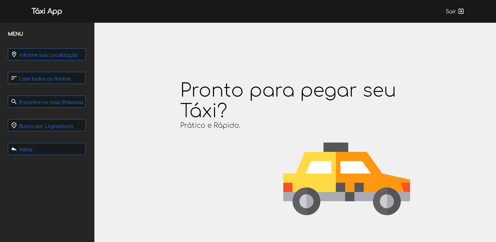
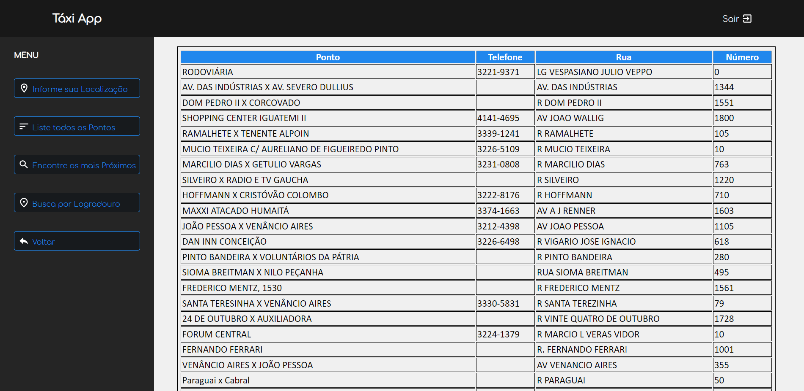
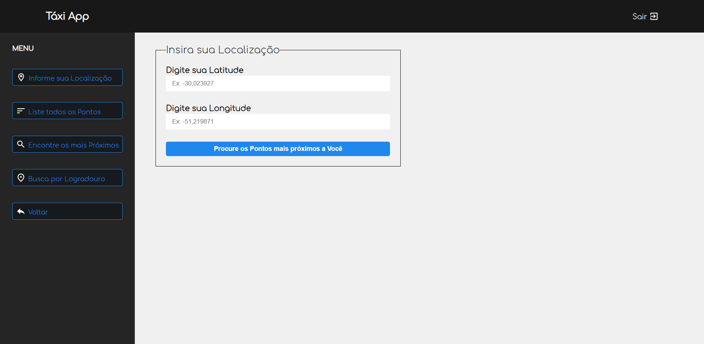

# Projeto - Táxi App

Aplicação Web que oferece informações sobre Ponto de Táxi na cidade de Porto Alegre/RS.

#####Entre suas funções estão:
- [x] Lista todos os Pontos de táxi da Cidade

- [x] Permiti que o usuário digite sua localização
geográfica no formato Latitude e Longitude

- [x] Permite que o Usuário busque pontos por digitar parte do Nome da Rua
- [ ] Encontra pontos Próximos baseado na localização informada

---

Tecnologias Usadas:
- React
- Node/Express 

---

